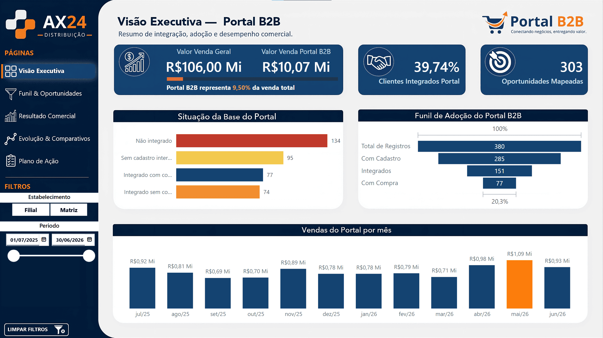
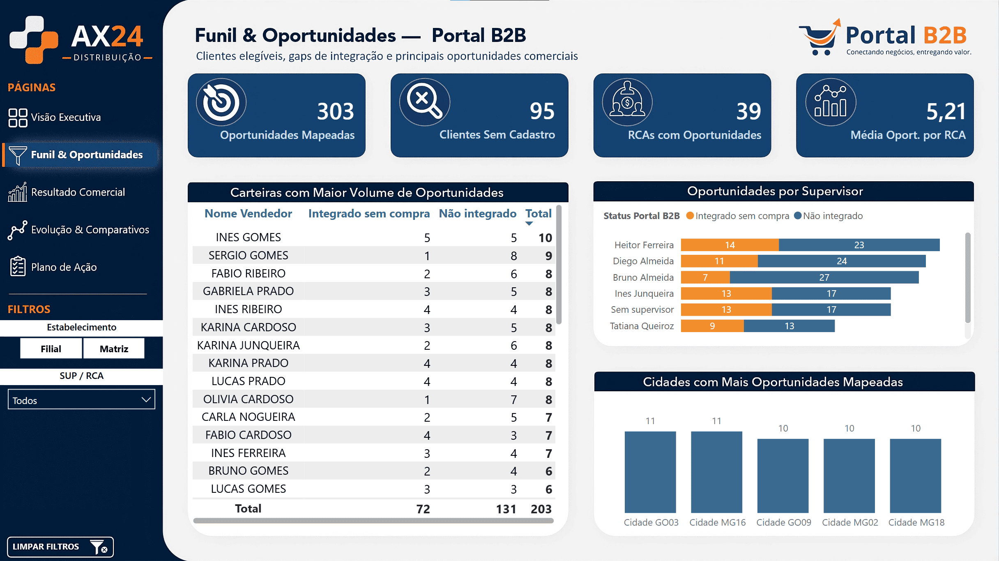
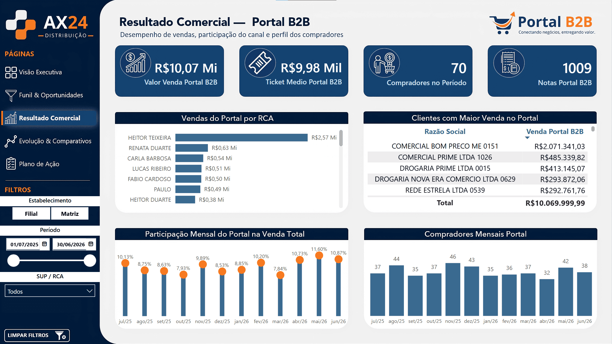
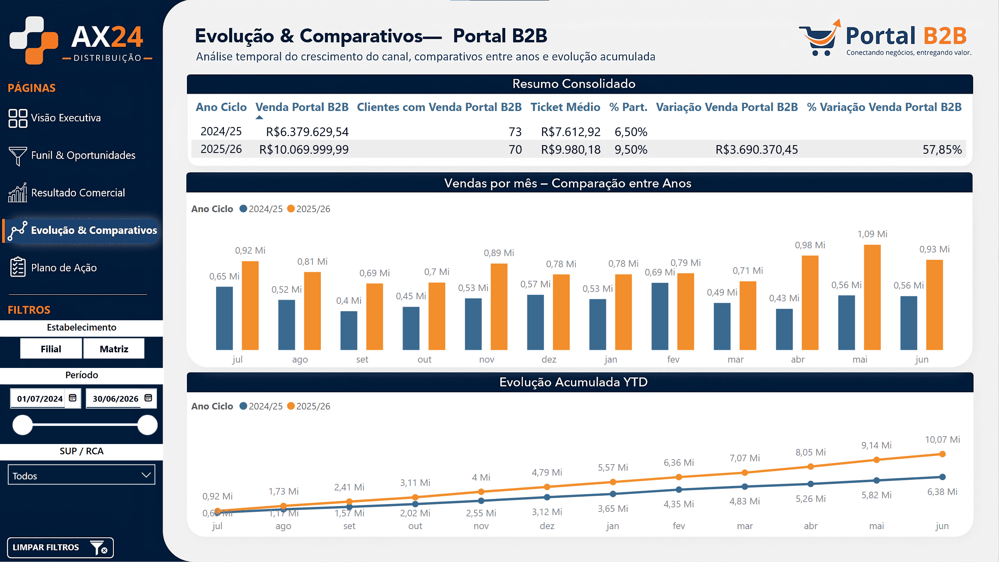
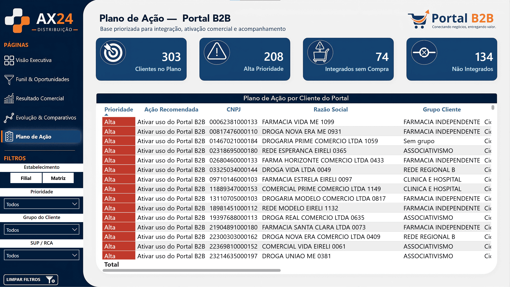

# Portal B2B — Análise de Adoção de Canal Digital

Diagnóstico de um canal digital de vendas em uma distribuidora farmacêutica:
quem usa a plataforma, quem está conectado à empresa, quem já compra por ela — e
o que fazer com quem falta.

> **Dados sintéticos.** Este projeto reconstrói um caso corporativo real com uma
> base gerada por script. Metodologia, estrutura e regras de negócio são reais;
> os dados, não. Detalhes em [`docs/base-sintetica.md`](docs/base-sintetica.md).


---

## O problema

A discussão começou numa reunião de líderes sobre receita e margem. Ao chegar
nos canais de venda, ficou claro que o canal digital era o menos compreendido de
todos.

A distribuidora já estava tecnicamente integrada à plataforma de pedidos. Mas a
integração não era automática para o cliente: **cada farmácia precisava
solicitar individualmente a conexão com a distribuidora** para que seus pedidos
chegassem. Sem isso, o cliente usava a plataforma normalmente — e comprava de
outro fornecedor.

Ninguém sabia responder perguntas básicas:

- Quantos clientes usam a plataforma?
- Quantos deles estão conectados à empresa?
- Quantos já existem no cadastro interno?
- Quantos, mesmo conectados, nunca compraram pelo canal?
- Quanto o canal representa no faturamento?

A informação existia, mas dividida entre dois sistemas que não se conheciam: o
ERP interno e o BI da plataforma. Nenhum dos dois respondia sozinho.

## A pergunta

> Este canal é uma alavanca de receita ou um custo sem retorno?

E, atrás dela, uma segunda que mudou o tom da discussão: se essas farmácias já
usam a plataforma e vão comprar por ela de qualquer forma, **a questão não é se
vão comprar — é de quem.**

---

## O que a análise mostrou

### No caso original

Descrito sem números, por confidencialidade.

O canal era pequeno em faturamento, e essa era a leitura que todos tinham. Mas a
base de clientes que já usava a plataforma **sem estar conectada à empresa** era
muito maior do que a base ativa.

O gargalo nunca foi demanda. Era ligação entre dois cadastros que já existiam —
e ninguém havia cruzado.

Nenhuma técnica sofisticada produziu esse resultado. O que produziu foi juntar
duas fontes que a empresa já tinha em mãos.

A empresa executou o plano de ação, e a direção propôs uma política de preços
dedicada ao canal.

### Na base sintética

Os números abaixo vêm da base gerada por script e servem para demonstrar o
método — não são conclusões sobre nenhuma operação real. Alguns deles são
parâmetros de entrada do gerador, não descobertas.

**O canal cresceu sete vezes mais rápido que a empresa, sem ganhar um cliente.**

| | Ciclo anterior | Ciclo atual | |
|---|---:|---:|---:|
| Faturamento do canal | R$ 6,38 Mi | R$ 10,07 Mi | **+57,85%** |
| Participação no total | 6,50% | 9,50% | +3,0 p.p. |
| Clientes comprando pelo canal | 73 | 70 | **−3** |
| Ticket médio | R$ 7.612 | R$ 9.980 | +31,1% |

Todo o crescimento veio de quem já usava passando a usar mais. A base não
expandiu — encolheu.

**Quatro em cada cinco usuários da plataforma nunca compraram por ela.**

```
380  clientes usam a plataforma
285  têm cadastro interno
151  estão integrados
 77  já compraram pelo canal        →  20,3% de conversão
```

O canal já provou que funciona: quem adota, aprofunda rápido. O problema está na
conversão da base que já está lá.

---

## O dashboard

### Visão Executiva



Dimensiona o canal e a base em uma tela. O funil de adoção mostra onde a base se
perde entre o registro na plataforma e a primeira compra, e a situação da base
separa os quatro estados que exigem ações diferentes.

Dois indicadores foram desenhados para serem acompanhados ao longo do tempo: o
percentual de clientes integrados, que deve subir com a execução do plano, e a
quantidade de oportunidades mapeadas, que deve cair à medida que forem
trabalhadas.

### Funil & Oportunidades



Localiza as oportunidades por carteira, supervisor e cidade. É a página que
transforma um número agregado em trabalho atribuído a alguém.

A leitura mais útil aqui é o cruzamento entre carteira e resultado comercial: um
vendedor com volume relevante concentrado em poucos clientes, e várias
oportunidades ainda não trabalhadas, tem margem de crescimento maior que o
número absoluto de vendas sugere.

### Resultado Comercial



Passa das oportunidades para o que já aconteceu: quanto o canal vendeu, para
quem, por qual carteira e com que ticket.

A quantidade de compradores por mês é o indicador que sustenta a tese central —
comparada à curva de faturamento, ela revela que o crescimento vem de
aprofundamento, não de expansão de base.

### Evolução & Comparativos



Compara dois ciclos completos de doze meses. Como a janela de dados vai de julho
a junho, o ano civil partiria os períodos ao meio — o calendário recebeu um
ciclo customizado para viabilizar a comparação.

O acumulado permite ver a distância entre os ciclos se abrindo mês a mês, em vez
de apenas o total no fim do período.

### Plano de Ação



A entrega final. Cada cliente com sua situação, ação recomendada, prioridade e
responsável — filtrável e exportável, para distribuição entre supervisores e
vendedores.

| Situação | Ação recomendada | Prioridade |
|---|---|---|
| Integrado e comprando | acompanhar cliente ativo | monitoramento |
| Integrado, nunca comprou | ativar uso do canal | alta |
| Cadastrado, não integrado | solicitar integração | alta |
| Sem cadastro interno | avaliar cadastro | média |
| Bloqueado | validar cadastro e financeiro | validação |

A ordem das regras importa: o bloqueio é avaliado antes de tudo. Invertida, a
lógica mandaria ação comercial para cliente inadimplente.

---

## Como foi construído

```
ERP (SQL Server)                      Plataforma (planilhas)
7 tabelas brutas                      2 arquivos, um por região
       │                                       │
       ▼                                       │
5 views SQL                                    │
regras de negócio, tradução                    │
de códigos, janela temporal                    │
       │                                       │
       └───────────► Power Query ◄─────────────┘
                     chave, mesclagens,
                     estados do funil
                            │
                            ▼
                     Modelo dimensional
                     2 fatos, 4 dimensões
                            │
                            ▼
                     Medidas DAX e dashboard
```

O princípio: **tratar o mais cedo possível, na camada onde a regra é estável.**
Regra de negócio que vale para qualquer consumidor fica no SQL. Limpeza
específica de arquivo externo fica no Power Query. Só o que depende de contexto
de filtro fica em DAX.

Três decisões que definiram o resultado:

**Duas views para compra, com janelas diferentes.** A view fato cobre 24 meses;
a de última compra lê o histórico inteiro. É essa diferença que separa "nunca
comprou" de "comprou há muito tempo" — situações comerciais opostas que a
primeira sozinha confundiria.

**Um quinto do movimento é descartado.** Devolução, bonificação, transferência e
notas canceladas circulam pela mesma tabela que a venda. Sem os filtros, o
faturamento incluiria o que não é receita.

**Registro incompleto se rotula, não se remove.** Cliente sem grupo comercial,
cidade inexistente, vendedor sem supervisor — todos permanecem na base com
rótulo explícito. Remover quebraria a reconciliação com o sistema de origem.

O detalhamento está em
[`docs/decisoes-tecnicas.md`](docs/decisoes-tecnicas.md), incluindo uma medida
que estava correta na linha e multiplicada no total, e como o erro foi
encontrado.

---

## Stack

`SQL Server` · `T-SQL` · `Power BI` · `Power Query (M)` · `DAX` · `Python` · `Git`

---

## Estrutura do repositório

```
data-generator/   gerador da base sintética
data/             tabelas brutas em CSV
data-portal/      exportações da plataforma em Excel
sql/              DDL, carga, views e conferência
powerbi/          arquivo .pbix
docs/             documentação técnica
images/           layouts e capturas do dashboard
```

## Como reproduzir

```powershell
cd data-generator
python -m venv .venv
.venv\Scripts\Activate.ps1
pip install -r requirements.txt
python gerar_base.py
```

Depois, `sql/01_ddl_e_carga.sql` cria as tabelas e faz a carga — ajuste os
caminhos antes de executar —, `sql/02_views/` cria as cinco views, e
`sql/03_conferencia.sql` devolve os números citados aqui.

O gerador usa semente e data de referência fixas: rodar duas vezes produz
exatamente a mesma base.

---

## Documentação

| Documento | Conteúdo |
|---|---|
| [`decisoes-tecnicas.md`](docs/decisoes-tecnicas.md) | Modelagem, grão, tratamento de nulos, medidas |
| [`base-sintetica.md`](docs/base-sintetica.md) | Origem dos dados, imperfeições deliberadas, limitações |
| [`resultados-conferencia.md`](docs/resultados-conferencia.md) | Números medidos, com script de verificação |
| [`diario-de-decisoes.md`](docs/diario-de-decisoes.md) | Registro cronológico das decisões |

---

## Sobre os dados

A empresa, a plataforma, os clientes e os valores são fictícios. A base é gerada
por script, com semente fixa, e inclui imperfeições deliberadas — movimento que
não é venda, cadastros incompletos, chaves com formatos diferentes entre as
fontes — para que os tratamentos aplicados tenham contra o que trabalhar.

Os números apresentados demonstram o método e permitem que qualquer pessoa
reproduza o cálculo. Não são evidência sobre nenhuma operação real.